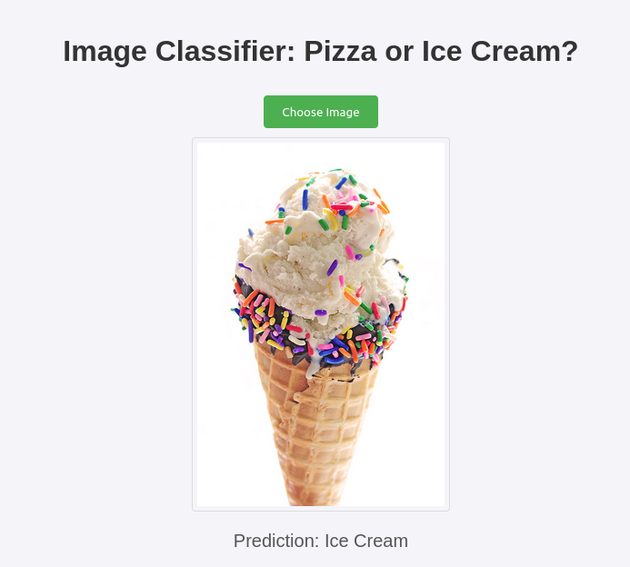

# Pizza vs Ice-cream

Dataset from Kaggle
<https://www.kaggle.com/datasets/hemendrasr/pizza-vs-ice-cream>

## Introduction
This repository is the result of a school project and is meant to showcase building docker images for ML (use the result of ML training)

## Features
As of now, the built docker image can predict if an image is that of a pizza or an ice-cream. This simple model can be easily replaced using the ml_builder and a new dataset.

## Technologies used
- Tensorflow
- Flask
- Numpy
- Pillow
- Gunicorn
- Docker
- Python virtualenv

## Installation and Setup
To use this repository, run the ml_builder.py with the correct dataset. If not changed, use 'dataset', it contains a split of training, validation and testing images. 

## Usage
Create a new environment
```
virtualenv .tf
source .tf/bin/activate (for other shells, f.e. fish, use activate.fish instead)
```
Install packages to the newly created python environment
```
# Double check path with 'which' command
which pip
pip install -r requirements.txt
```
Train the model, this creates a 'model.h5' :
`python ml_builder.py`

## Docker image
### Building the docker image
Don't forget to add the period since we're building from our current path (this folder). You can replace the 'pizza-or-icecream' with whatever image name you'd like.
`docker build -t pizza-or-icecream .`

### Docker image settings
The built image exposes port `80` and binds to `0.0.0.0:80` inside.

### Run the docker image
```
docker run -p 127.0.0.1:8080:80 --name test --rm -it \
pizza-or-icecream
```

## Images
### Pizza? Yes.

### Ice-cream? Also yes.
